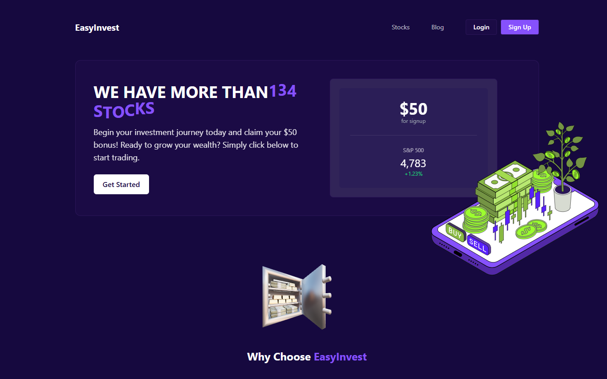

# 📊 EasyInvest – Investment Platform (In Development)

**EasyInvest** is a modern investment platform built with Next.js (React). The app is currently under development and will allow users to explore stock opportunities, understand investment benefits, and get started easily.



---

## 🚀 Features

- 📈 Hero section with animated statistics
- 💰 Call-to-action for new investors
- 📊 Dynamic 3D visual elements (Three.js)
- 🧩 Modular and reusable components
- 🧠 SEO-optimized structure with SSR
- ⚙️ Clean and scalable codebase

---

## 🛠️ Tech Stack

- **Framework**: Next.js (App Router)
- **Styling**: Tailwind CSS
- **Animation**: Framer Motion, Lottie, Three.js
- **Rendering**: Server-Side Rendering (SSR)

---

## 🧪 Getting Started Locally

### 1️⃣ **Clone the Repository**

```
git clone https://github.com/alex-bodn/easyinvest.git
cd easyinvest
```


### 2️⃣ **Install Dependencies**

```
npm install
```


### 3️⃣ **Install MongoDB**

```
https://www.mongodb.com/try/download/community
```

### 🏃‍♂️ **Running the Project Locally**

```
npm run dev
```